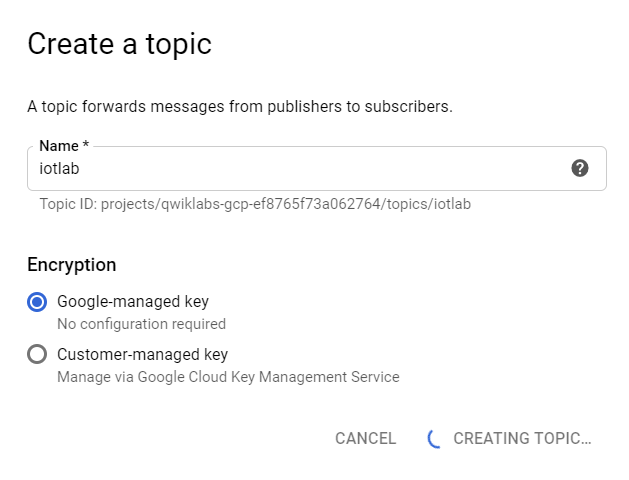
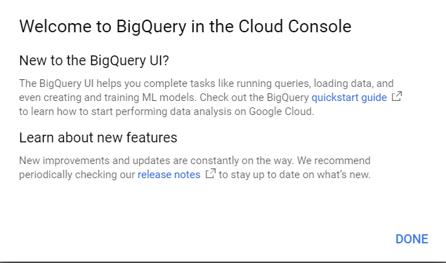
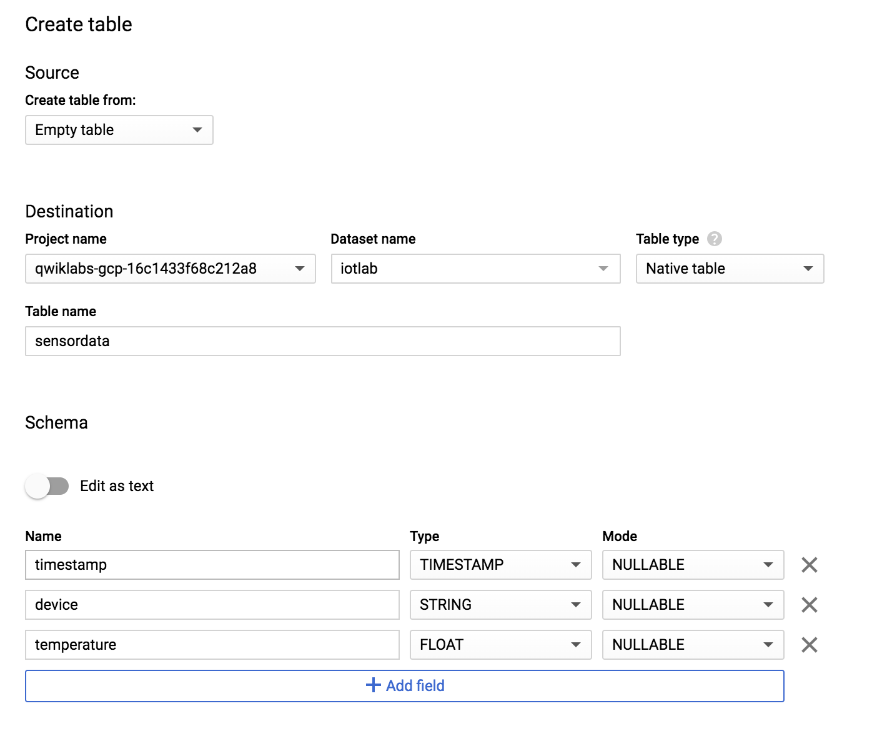
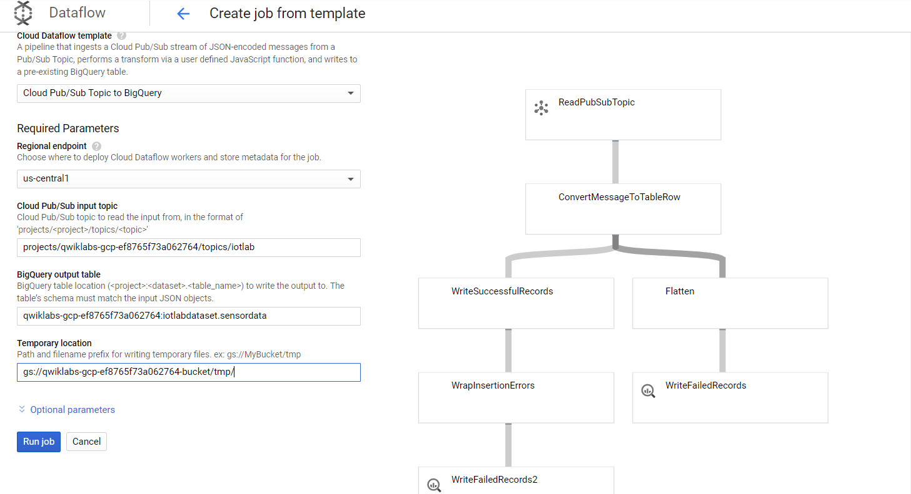
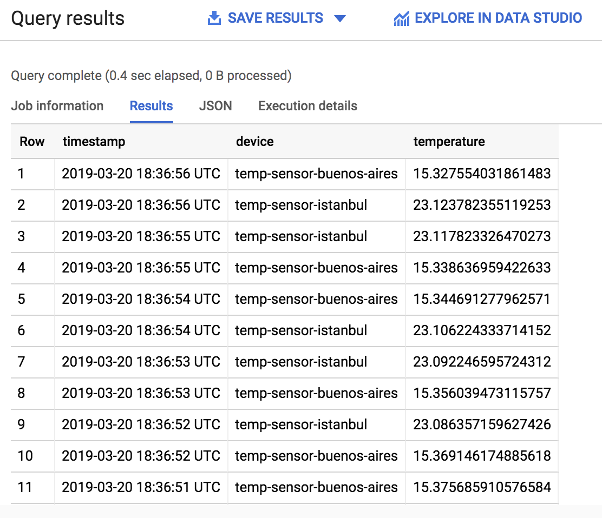

# Create Pub/Sub:

# Creating Big Query:
! 

# Data Flow

# Sensor Data big query

Reference:https://timewithai.wordpress.com/2019/07/27/building-an-iot-analytics-pipeline-on-google-cloud-platform-step-by-step/
